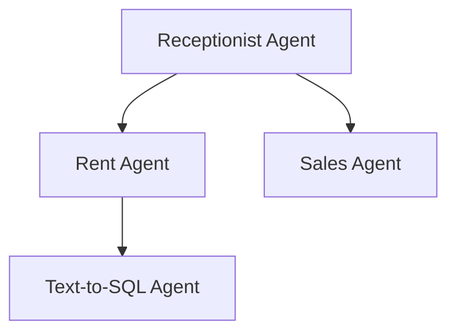
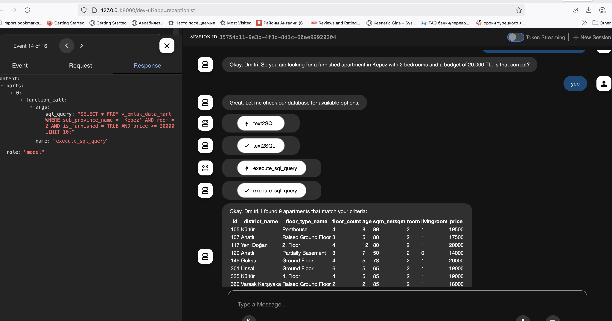

# Real Estate Agent AI Assistant on Google Agent Development Kit

## Overview
This project is an AI-powered assistant designed for a real estate agency. The assistant helps potential buyers and renters find their ideal property by engaging them in a conversation. It gathers user preferences such as location, budget, property type, and other criteria, and provides relevant property options from the agency's database.

It leverages the functionality of the [Google Agent Development Kit (ADK)](https://google.github.io/adk-docs/). The data the agent currently works with is scraped from [Hepsiemlak](https://www.hepsiemlak.com/en/), a Turkish real estate portal.

Currently, it supports rental searches for apartments only.

## Features
- **Interactive Conversations**: The assistant engages users in natural language conversations to understand their preferences.
- **Property Search**: Supports filtering properties based on location, budget, property type, and other attributes.
- **SQL Query Generation**: Converts user queries into SQL statements to fetch data from the database.
- **Agent System**: Includes specialized agents for renting and sales processes.
- **Session Management**: Maintains session state to track user interactions and preferences.


## Project Structure
The project is organized as follows:

```
real_estate_agent/
├── pyproject.toml          # Project dependencies and metadata
├── README.md               # Project documentation
├── sql/                    # SQL scripts and views
│   ├── v_emlak_by_disticts.sql
│   └── v_emlak_data_mart.sql
├── src/                    # Source code
│   ├── settings.py         # Configuration settings
│   ├── utils/              # Utility functions
│   │   ├── utils.py
│   │   └── sql_communicator.py
│   ├── agents/             # AI agents
        ── receptionist/   # Receptionist agent
        │   ├── agent.py
        │   ├── sub_agents
        │   │   ├── rent_agent
        │   │   │   └── agent.py
        │   │   └── sales_agent
        │   │       └── agent.py
│   │   ├── text2SQL/       # Text-to-SQL agent
│   │   └── shared_agent_tools.py
│   ├── tests/              # Unit tests
│   │   ├── test_utils.py
│   │   ├── test_sql.py
│   │   └── test_agents.py
```

## Key Components

### Agents
- **Receptionist Agent**: Acts as the first point of contact for clients. Delegates tasks to specialized agents.
- **Rent Agent**: Assists clients in finding rental properties based on their preferences.
- **Sales Agent**: Handles payment calculations and provides detailed information about selected properties.
- **Text-to-SQL Agent**: Converts natural language queries into SQL statements for database interaction.

### Agent Relationships
Below is a mermaid diagram illustrating the relationships between the agents:



### Utilities
- **`utils.py`**: Contains helper functions like `make_json_serializable` and `safe_format`.
- **`sql_communicator.py`**: Handles database interactions using SQLAlchemy.

### SQL Views
- **`v_emlak_data_mart.sql`**: Defines a view for detailed property data.
- **`v_emlak_by_disticts.sql`**: Aggregates property data by districts.

### Tests
- Comprehensive unit tests are provided for utilities, SQL interactions, and agents.

## Details of Implementation
- In addition to the agents described above, the project includes a `Text2SQLAgent`, a specialized agent used by other agents as a tool for generating SQL queries from natural language.
- The `text2SQL` and `rent_agent` components pull metadata from the database to inject it into the system prompt. To make this work, it is crucial to have comments on the columns of the views and tables used by the agents. Example for Postgres:
    ```SQL
    COMMENT ON COLUMN v_emlak_data_mart.district_name IS 'Name of the local district (mahalle in Turkey), like "Liman" for Konyaaltı district, where the property is located';
    COMMENT ON COLUMN v_emlak_data_mart.room IS 'Number of bedrooms in the property';
    ```
- The system retrieves a distinct set of geographical attributes (province, sub-province, district) and injects them into the prompt for the rent agent. This facilitates communication with the user regarding their desired property location.

## Setup

### Prerequisites
- Python 3.12 or higher
- PostgreSQL database

### Installation
1. Clone the repository:
   ```bash
   git clone <repository-url>
   cd real_estate_agent
   ```
2. Install dependencies:
   ```bash
   uv create
   source .venv/bin/activate
   uv install
   ```
3. Configure the database connection, LLM model name (currently it is using gemini-2.0-flash)in `src/settings.py`.

### Running the Application
1. Launch the web UI for agents:
 (this should be launched when you have src/agents as current folder)
   ```bash
   adk web
   ```
2. Open ADK Web in browser, choose agent from the list and start conversation. Note: each folder under "Agents" folder here will show up in ADK web as agent
3. Interact with the agents through the web interface.
4. In order to understand what is going on 'under the hood', explore events, state in the adk UI, 


### Running Tests
Run unit tests using the following command:
```bash
python -m unittest discover -s ./src/tests -p "*test*.py"
```

## Dependencies
- [**Google ADK**](https://google.github.io/adk-docs/): Used for building AI agents. 
- **[SQLAlchemy](https://www.sqlalchemy.org/)**: For database interactions.
- **[SQLGlot](https://github.com/tobymao/sqlglot)**: For SQL parsing and validation.
- [**DEZC-FinalProject**](https://github.com/DmitriiK/DEZC-FinalProject): my DE project, where I have ETL for the population of DB, and where SQL schema is defined.
## Known issues
 - search does not work for the words with specific Turkish symbols, like 'ş, ı'
 - payment agent for some reason provide data as json, not tabular, at least under Gemini
 ## Thoughts about further development
 - Add RAG semanitic search using vector fields in Postgres
 --Teach it to use IDs columns to filter out data, not names only as it is now.
 - Persist user data between sessions
 - Leverage geo data to search by distnanse to sea or whatever
 - Integrate to Telegram agent